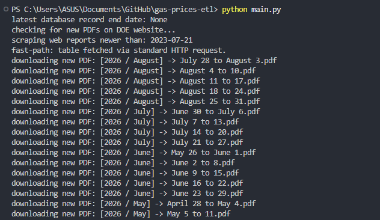
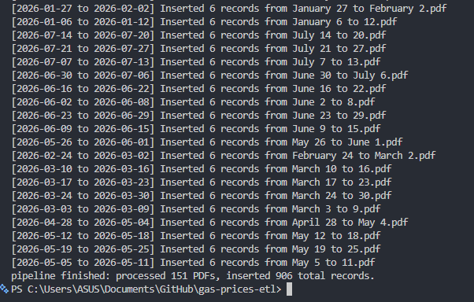
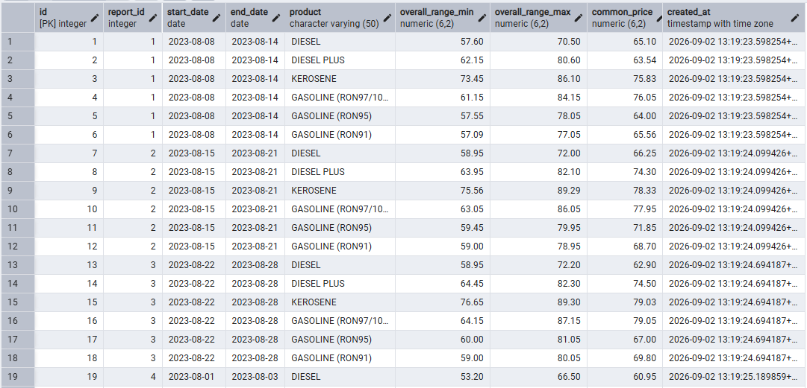

# gas-prices-etl

an ETL (extract, transform, load) pipeline that automatically scrapes, parses, and loads National Capital Region (NCR) gas price PDF reports from the Department of Energy (DOE) into a PostgreSQL database.

---

### live production demo

this repository powers the automated data pipeline for the **[NCR Gas Price Analytics](https://gas-price-analytics.vercel.app/)** web application. 

- scrapes dynamic DOE PDF reports, normalizes multi-year pricing structures, and loads records into PostgreSQL via Supabase.
- consumes the ingested data to serve interactive price trends, regional averages, and historical comparisons.

---

### screenshots

#### 1. web scraping & pdf download (`scrape.py`)


*automated fetching and downloading of PDF reports from the DOE portal.*

#### 2. pdf parsing & database ingestion (`main.py`)


*parsing gas prices from PDFs and batching records into PostgreSQL.*

#### 3. postgresql database table (`ncr_gas_prices`)


*structured pricing data stored with unique constraints on date ranges and product types.*

---

### important notes
- the scraper (`scrape.py`) handles the updated DOE portal layout (`https://doe.gov.ph/data-and-prices/liquid-fuels/retail-pump-prices/ncr-pump-prices`). it uses Playwright and BeautifulSoup to render dynamic JavaScript tables, extract new PDF links, and download missing files automatically.
- PDF files are fetched starting from the cutoff date (July 21, 2023 to present) and saved locally inside organized folder structures under `downloads/`.
- reports are pre-screened using `peek_date_range()` to skip files whose date ranges are already stored in the database, preventing unnecessary heavy PDF parsing.
- extracted pricing data uses PostgreSQL's `ON CONFLICT (start_date, end_date, product)` clause to seamlessly update existing database entries without creating duplicate rows.

---

### installation & setup

1. **clone the repository and install required dependencies**
   ```bash
   pip install -r requirements.txt
   playwright install chromium
   ```

2. **configure database credentials in .env file**
   ```env
   DB_NAME=your_database_name
   DB_USER=your_database_user
   DB_PASSWORD=your_database_password
   DB_HOST=localhost
   DB_PORT=5432
   ```

3. **database setup**
   before running the pipeline, initialize your PostgreSQL database table using the provided `schema.sql` file:
   ```sql
   -- main table for the extracted data
   CREATE TABLE IF NOT EXISTS ncr_gas_prices (
   id SERIAL PRIMARY KEY,
   report_id INT NOT NULL,
   start_date DATE NOT NULL,
   end_date DATE NOT NULL,
   product VARCHAR(50) NOT NULL,
   overall_range_min NUMERIC(6, 2),
   overall_range_max NUMERIC(6, 2),
   common_price NUMERIC(6, 2),
   created_at TIMESTAMP WITH TIME ZONE DEFAULT CURRENT_TIMESTAMP,

   -- prevent inserting identical product records for the same date window
   CONSTRAINT unique_report_product UNIQUE (start_date, end_date, product)
   );
   
4. **verify local data**
   ensure a `downloads/` directory exists (or let the script create it). downloaded files will automatically be sorted into nested structures like `downloads/YYYY/Month/`.

---

### how to use
- just run the main entry script to trigger the full scraper and database sync pipeline
   ```bash
   python main.py
   ```

---

### main pipeline workflow
1. launches the browser via Playwright to fetch and render the DOE's dynamic HTML tables.
2. checks for missing or new PDF reports and downloads them into the `downloads/` directory.
3. recursively scans `downloads/` to locate all available `.pdf` documents.
4. extracts report metadata (`start_date` and `end_date`) from each PDF header using flexible regex patterns.
5. queries PostgreSQL to verify if the date range already exists.
6. parses product categories (*DIESEL*, *GASOLINE RON91/95/97*, *KEROSENE*) along with min, max, and common prices using `pdfplumber`.
7. inserts new rows or updates existing records in the `ncr_gas_prices` database table.